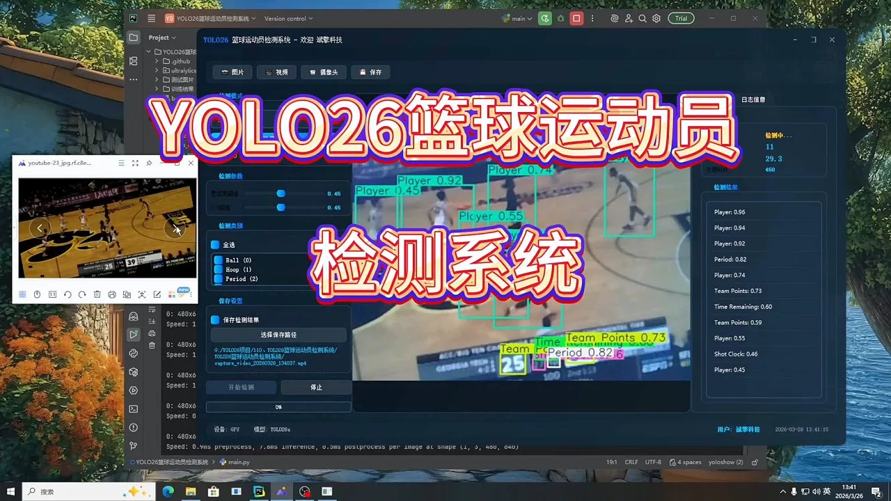
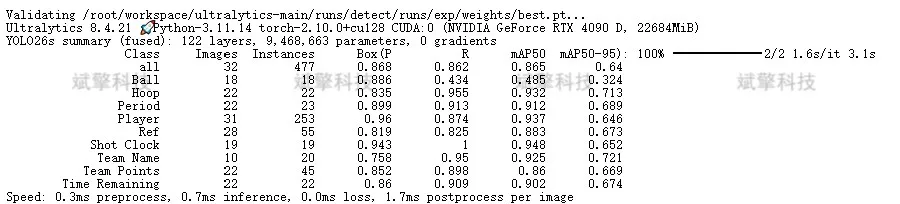
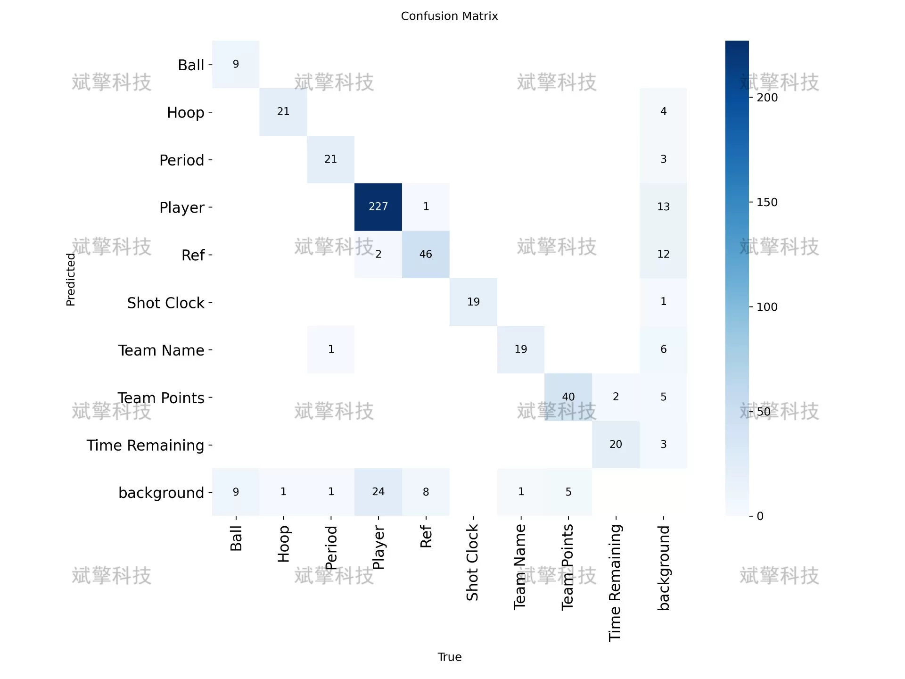
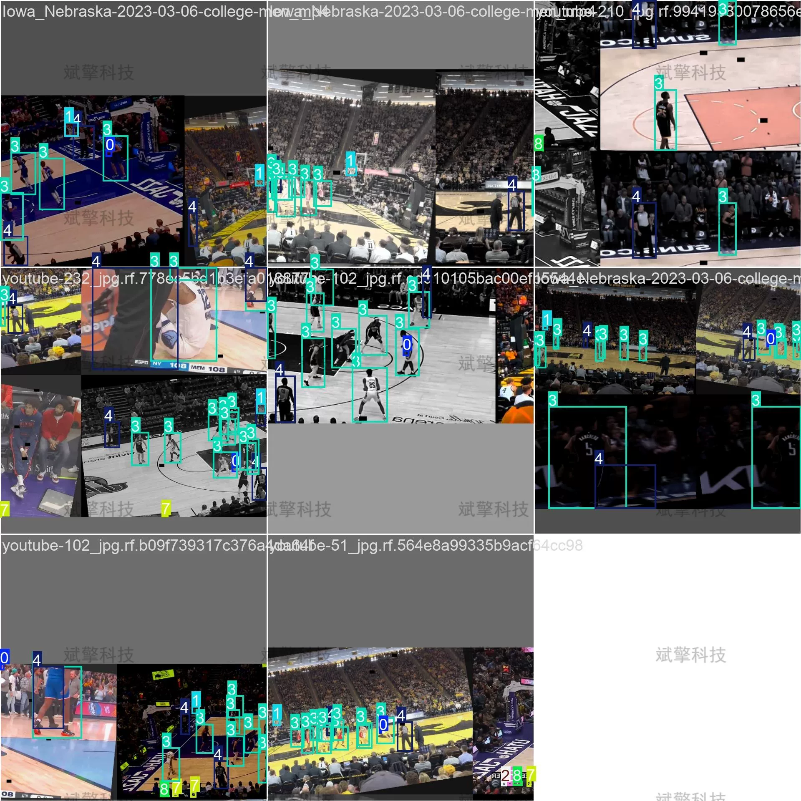
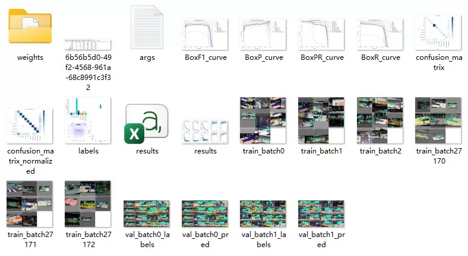
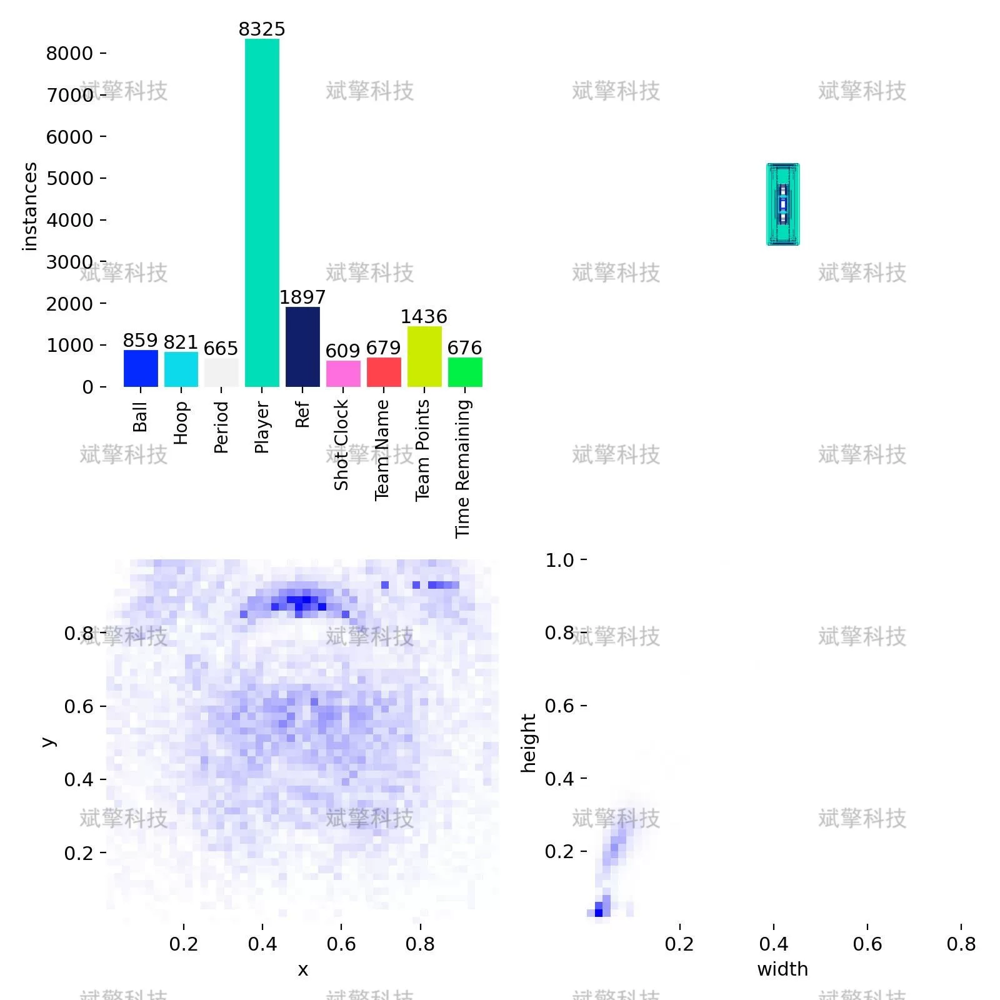
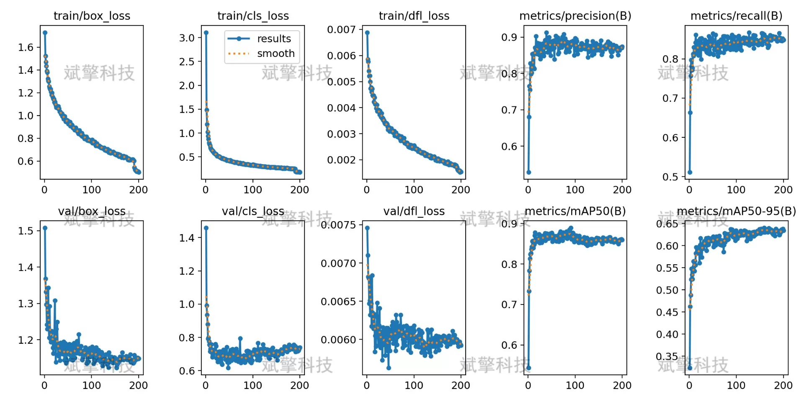
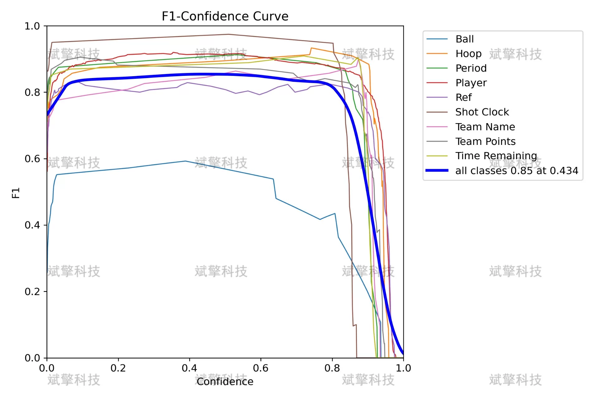
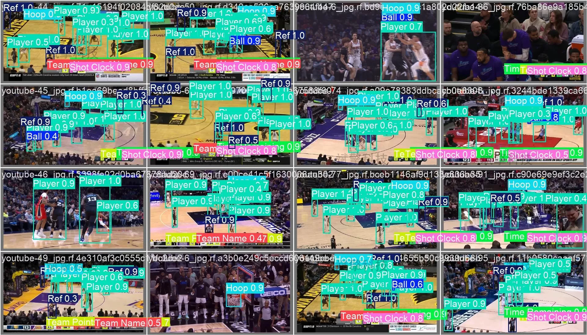

# YOLOv26 Basketball Athlete Detection System | Dataset

## Body

YOLOv26 Basketball Athlete Detection System | Dataset for YOLOv26 Basketball Athlete Detection System: 9 Classes of Key Object Recognition (with mAP 86.5% Real Test) (Project Source Code + Dataset + Model Weights + UI Interface + Python + Deep Learning + Remote Environment Deployment)

This article is based on the YOLOv26 object detection algorithm and has built a multi-category target detection system for basketball games. The system can automatically recognize 9 key objects in basketball game videos: Ball, Hoop, Period, Player, Ref, Shot Clock, Team Name, Team Points, and Time Remaining. The model achieves an average precision (mAP50) of 86.5% on the validation set, with the detection accuracy of the Shot Clock being the highest at 94.8%, and the detection accuracy of the Player reaching 96%. The experimental results show that this system can effectively detect various targets in basketball games, providing basic support for subsequent applications such as basketball tactics analysis, automatic commentary, and video content understanding.

The dataset contains 9 target categories, covering key elements in basketball games:
Ball    - The basketball used in the game
Hoop    - The basket and rebound area
Period    - The display of the number of games (1st, 2nd, 3rd, 4th, etc.)
Player    - The player on the court
Ref    - The referee
Shot Clock    - The offensive clock (24-second timing)
Team Name    - The team name displayed
Team Points    - The team score displayed
Time Remaining    - The remaining time displayed in the game

Free remote installation reservation. Unsuccessful full refund.
Purchase enjoy the following resources (Baidu Drive auto unlock)
     YOLO recognition detection project complete source code
    ️ YOLO format dataset
      Training code + UI interface code
      Trained model + result images
      Software install package
    ️ Add WeChat reservation for remote installation (Automatically display WeChat ID after purchase) - Unsuccessful, full refund

⚙️ Core function modules
Detection capability
   - Image detection: upload and check immediately, return detection box + category information
   - Video detection: supports video files, analyze each frame accurately
   - Camera real-time detection: connect to USB camera, realize dynamic monitoring
Interaction and control
   - Target selection: freely choose one or more categories for detection
   - Parameter adjustment: adjustable confidence threshold & IoU threshold, flexibly control accuracy
   - Results saving: save image/video/camera detection results in one click
System and data
   - User login registration: Support password strength detection + encryption storage
   - Log recording: automatically record operation and error information (timestamped)

## Images

## Payment

Here is a pay link on Stripe ( https://buy.stripe.com/3cs8yP7sY87d0vu9AB ). Please contact me lonlonago@foxmail.com after funding $89, and I will send you a complete data files , thank you!

